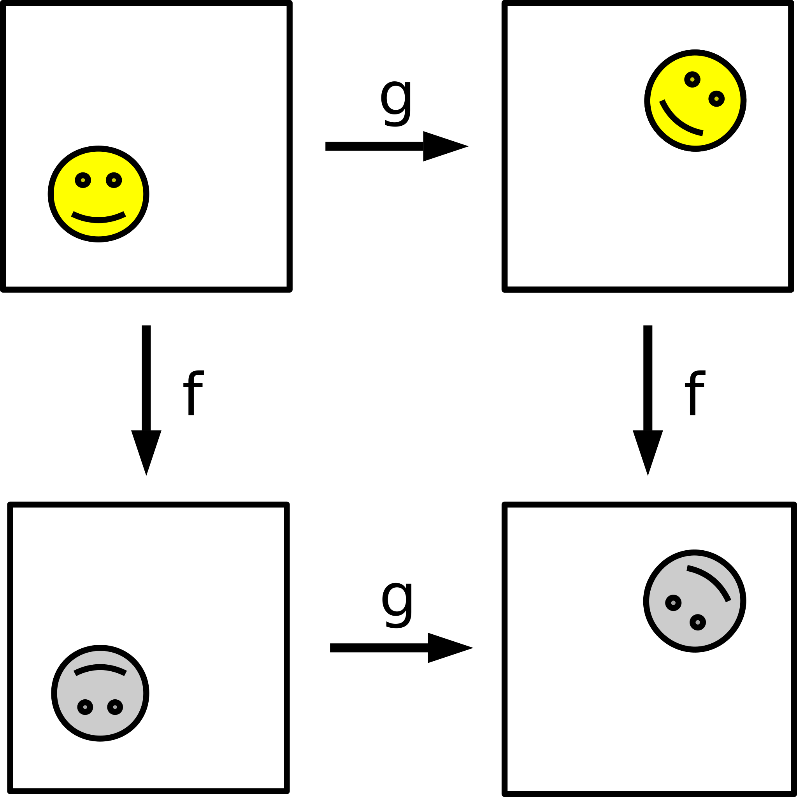
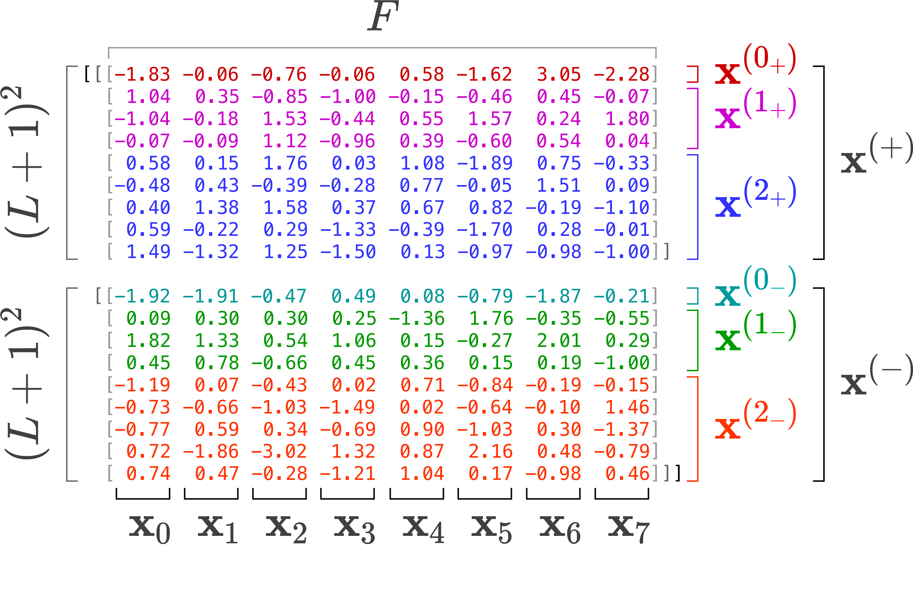
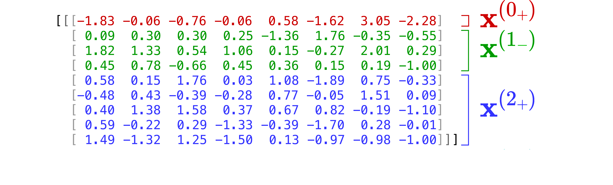
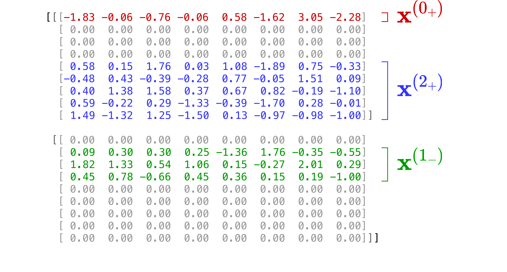
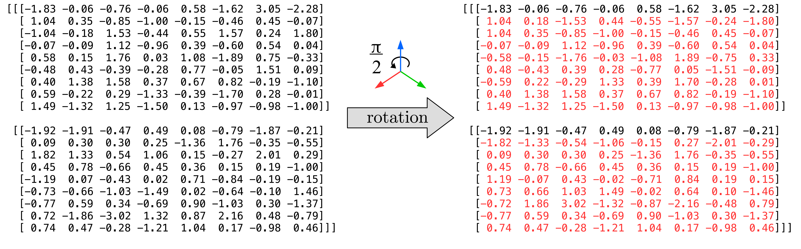
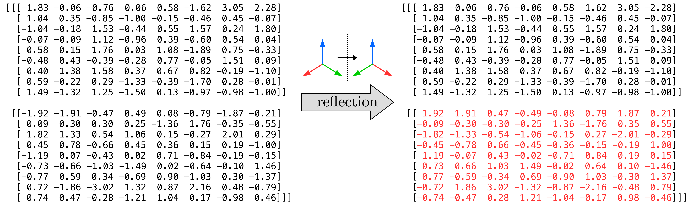

Overview
========

When should I use E3x?
----------------------

Whenever you are working with data that "lives" in three-dimensional space
(for example `molecules <https://en.wikipedia.org/wiki/Molecule>`_,
`point clouds <https://en.wikipedia.org/wiki/Point_cloud>`_, or
`polygon meshes <https://en.wikipedia.org/wiki/Polygon_mesh>`_), using an
:math:`\mathrm{E}(3)`-equivariant model is probably beneficial. E3x contains
:math:`\mathrm{E}(3)`-equivariant implementations of many typical neural network
building blocks, saving you the time of implementing them yourself.

Mathematical background
-----------------------

.. _Groups:

What is :math:`\mathrm{E}(3)`?
^^^^^^^^^^^^^^^^^^^^^^^^^^^^^^

:math:`\mathrm{E}(3)` is the name of a **group**. A
`group <https://en.wikipedia.org/wiki/Group_(mathematics)>`_ is a
`set <https://en.wikipedia.org/wiki/Set_(mathematics)>`_ equipped with an
`operation <https://en.wikipedia.org/wiki/Binary_operation>`_ that combines any
two `elements <https://en.wikipedia.org/wiki/Element_(mathematics)>`_ of the set
to produce a third element of the set, in such a way that the operation is
`associative <https://en.wikipedia.org/wiki/Associative_property>`_, an
`identity element  <https://en.wikipedia.org/wiki/Identity_element>`_
exists, and every element has an
`inverse <https://en.wikipedia.org/wiki/Inverse_element>`_. In three-dimensional
space, the following groups are especially relevant:

:math:`\mathrm{E}(3)`
   `Euclidean group <https://en.wikipedia.org/wiki/Euclidean_group>`_ in three
   dimensions, comprising all
   `translations <https://en.wikipedia.org/wiki/Translation_(geometry)>`_,
   `rotations <https://en.wikipedia.org/wiki/Rotation_(mathematics)>`_, and
   `reflections <https://en.wikipedia.org/wiki/Reflection_(mathematics)>`_ of
   the three-dimensional
   `Euclidean space <https://en.wikipedia.org/wiki/Euclidean_space>`_
   :math:`\mathbb{E}^3` and arbitrary finite combinations of them.

:math:`\mathrm{SE}(3)`
   Special `Euclidean group <https://en.wikipedia.org/wiki/Euclidean_group>`_ in
   three dimensions
   (`translations <https://en.wikipedia.org/wiki/Translation_(geometry)>`_ and
   `rotations <https://en.wikipedia.org/wiki/Rotation_(mathematics)>`_).

:math:`\mathrm{O}(3)`
   `Orthogonal group <https://en.wikipedia.org/wiki/Orthogonal_group>`_ in three
   dimensions
   (`rotations <https://en.wikipedia.org/wiki/Rotation_(mathematics)>`_ and
   `reflections <https://en.wikipedia.org/wiki/Reflection_(mathematics)>`_).

:math:`\mathrm{SO}(3)`
   `Special orthogonal group <https://en.wikipedia.org/wiki/Orthogonal_group#SO(n)>`_
   in three dimensions
   (`rotations <https://en.wikipedia.org/wiki/Rotation_(mathematics)>`_).

What does equivariant mean?
^^^^^^^^^^^^^^^^^^^^^^^^^^^

Equivariance is a property of functions from :math:`n` real numbers to :math:`m`
real numbers. To define
what it means exactly, we first need to introduce the concept of a
**representation**. A (linear)
`representation <https://en.wikipedia.org/wiki/Group_representation>`_
:math:`\rho` of a
`group <https://en.wikipedia.org/wiki/Group_(mathematics)>`_ :math:`G` is a
function from :math:`G` to square
`matrices <https://en.wikipedia.org/wiki/Matrix_(mathematics)>`_ such that for
all :math:`g,h \in G`

.. math::
   \rho(g)\rho(h) = \rho(gh)\,.

A function :math:`f: \mathcal{X} \mapsto \mathcal{Y}`, where
:math:`\mathcal{X}=\mathbb{R}^n` and :math:`\mathcal{Y}=\mathbb{R}^m` are
`vector spaces <https://en.wikipedia.org/wiki/Vector_space>`_, is called
**equivariant** with respect to a group :math:`G` and representations
:math:`\rho^\mathcal{X}` and :math:`\rho^\mathcal{Y}` (meaning representations
in the vector spaces :math:`\mathcal{X}` and :math:`\mathcal{Y}`) if for all
:math:`g \in G` and :math:`\mathbf{x} \in \mathcal{X}`:

.. math::
   f\left(\rho^\mathcal{X}(g)\mathbf{x}\right) = \rho^\mathcal{Y}(g)f(\mathbf{x})\,.

When :math:`\rho ^\mathcal{Y}(g)` is the
`identity function <https://en.wikipedia.org/wiki/Identity_function>`_,
:math:`f` is called **invariant** with respect to :math:`G`.

To put it simply: If a function :math:`f` is equivariant, it does not matter
whether a transformation is applied to its input or output, the result is the
same:

|

.. _Irreps:

(Irreducible) representations of :math:`\mathrm{O}(3)`
^^^^^^^^^^^^^^^^^^^^^^^^^^^^^^^^^^^^^^^^^^^^^^^^^^^^^^

In a geometrical context, we are typically interested in representations of the
group :math:`\mathrm{O}(3)`. This is because the numerical values of physical
properties in three--dimensional space, e.g. (angular) velocities/momenta,
electric/magnetic dipoles, etc. depend on the chosen
`coordinate system <https://en.wikipedia.org/wiki/Coordinate_system>`_. By
applying an orthogonal transformation to the underlying
`basis vectors <https://en.wikipedia.org/wiki/Basis_(linear_algebra)>`_, a
different (but equally valid) coordinate system is obtained. So whenever we
describe a physical property by :math:`m` numbers, there is a rule that
determines how these :math:`m` numbers transform when going to a different
coordinate system. Usually, this transformation is linear, and thus describes a
representation of :math:`\mathrm{O}(3)` on the vector space
:math:`\mathbb{R}^m`.

Given two representations of :math:`\mathrm{O}(3)` on :math:`\mathbb{R}^m`
and :math:`\mathbb{R}^n`, we also get a representation on the concatenated
tuples of numbers on :math:`\mathbb{R}^{m+n}` called a
"`direct sum <https://en.wikipedia.org/wiki/Direct_sum>`_ representation". An
:math:`\mathrm{O}(3)`--representation is called
`irreducible <https://en.wikipedia.org/wiki/Irreducible_representation>`_ if
it cannot be written as a direct sum of smaller representations (by introducing
an appropriate coordinate system).

Irreducible representations (or **irreps**) of :math:`\mathrm{O}(3)` on
:math:`\mathbb{R}^m` exist only for odd dimensions :math:`m=2\ell+1`, where
:math:`\ell` is called the **degree** of the representation. Furthermore,
the element :math:`-Id\in \mathrm{O}(3)` (a reflection, :math:`Id` is the
`identity element  <https://en.wikipedia.org/wiki/Identity_element>`_) can only
operate as the multiplication by a number :math:`p \in \{+1, -1\}` in an
irreducible representation on :math:`\mathbb{R}^{2\ell+1}`. The number :math:`p`
is called the **parity** of the representation. Representations with
:math:`p=+1` are also called *even*, and with :math:`p=-1` *odd*. One can show
that for every :math:`\ell=0,1,2,\dots` and :math:`p=\pm1`, there is exactly one
irrep of degree :math:`\ell` and parity :math:`p` (up to change of coordinates
in :math:`\mathbb{R}^{2\ell+1}`). As a short-hand notation, we write particular
irreps as double-struck digits with a subscript ':math:`+`' or ':math:`-`',
e.g. :math:`\mathbb{0}_+` stands for an irrep of degree :math:`\ell = 0` and
parity :math:`p = +1`.

For example, the trivial one--dimensional representation
:math:`\mathrm{O}(3)\rightarrow\{+1\}` is :math:`\mathbb{0}_+`, and the
canonical three--dimensional representation given by
the identity map :math:`\mathrm{O}(3)\rightarrow\mathrm{O}(3)` is
:math:`\mathbb{1}_-`. These irreps correspond to
`scalars <https://en.wikipedia.org/wiki/Scalar_(physics)>`_ and
`vectors <https://en.wikipedia.org/wiki/Euclidean_vector>`_,
whereas the irreps :math:`\mathbb{0}_-` and :math:`\mathbb{1}_+`
correspond to
"`pseudoscalars <https://en.wikipedia.org/wiki/Pseudoscalar>`_" and
"`pseudovectors <https://en.wikipedia.org/wiki/Pseudovector>`_", respectively.
An example of a pseudoscalar would be the (signed) volume (see
`triple product <https://en.wikipedia.org/wiki/Triple_product>`_), an example of
a pseudovector would be the
`angular velocity <https://en.wikipedia.org/wiki/Angular_velocity>`_. In
general, irreps with even/odd degree and even/odd parity correspond to (proper)
`tensors <https://en.wikipedia.org/wiki/Cartesian_tensor>`_, whereas irreps with
even/odd degree and odd/even parity are referred to as
"`pseudotensors <https://en.wikipedia.org/wiki/Pseudotensor>`_".

As mentioned :ref:`above <Groups>`, the group :math:`\mathrm{O}(3)` consists of
rotations :math:`g\in \mathrm{SO}(3)\subset \mathrm{O}(3)` and reflections
that can be written as :math:`-Id \cdot g` for a :math:`g\in \mathrm{SO}(3)`. A
representation of :math:`\mathrm{O}(3)` also gives a representation of the
rotations :math:`\mathrm{SO}(3)` just by restricting it to the subset
:math:`\mathrm{SO}(3)\subset \mathrm{O}(3)`. The irreps of
:math:`\mathrm{SO}(3)` can all be obtained from irreps of :math:`\mathrm{O}(3)`
in this way and are characterized only by a degree :math:`\ell`, the parity
:math:`p` gives the rule how to extend an irrep from :math:`\mathrm{SO}(3)` to
:math:`\mathrm{O}(3)`.

For computations in E3x, we fix one particular basis in a particular
:math:`(2\ell+1)`--dimensional vector space, which can be described by
(real-valued)
`spherical harmonics <https://en.wikipedia.org/wiki/Spherical_harmonics#Connection_with_representation_theory>`_
of degree :math:`\ell`.

How does E3x work?
-------------------

.. _IrrepFeatures:

Irrep features
^^^^^^^^^^^^^^

Ordinary neural networks typically operate on features
:math:`\mathbf{x} \in \mathbb{R}^F`, where :math:`F` is the dimension of the
feature space. Typically, we think of :math:`\mathbf{x}` as an
:math:`F`--dimensional feature
`vector <https://en.wikipedia.org/wiki/Vector_(mathematics_and_physics)>`_, but
to understand how E3x works, it is helpful to instead think of
:math:`\mathbf{x}` as a collection of :math:`F` scalar features. In
E3x, a single feature is not a single scalar anymore, but instead consists of
:ref:`irreps <Irreps>` of :math:`\mathrm{O}(3)` with even and odd parities for
all degrees :math:`\ell = 0,\dots,L`, where :math:`L` is the maximum degree.
Features :math:`\mathbf{x} \in \mathbb{R}^{2\times (L+1)^2\times F}` are stored
in an :class:`ndarray <jax.numpy.ndarray>` like this (for this example,
:math:`L=2` and :math:`F=8`):

Here, the column :math:`\mathbf{x}_i` is the :math:`i`-th feature and we
use the short-hand notation :math:`\mathbf{x}^{(\ell_\pm)}` to refer to all
irreps of degree :math:`\ell` with parity :math:`p = \pm 1`, and
:math:`\mathbf{x}^{(\pm)}` to refer to all irreps of all degrees with parity
:math:`p = \pm 1`.

.. _FeatureSlicing:

In code, the different feature subsets can be conveniently accessed with array
slicing:

.. list-table::
   :align: center
   :header-rows: 1

   * - notation
     - code
   * - :math:`\mathbf{x}_i \in \mathbb{R}^{2\times(L+1)^2\times 1}`
     - ``x[:, :, i:i+1]``
   * - :math:`\mathbf{x}^{(+)} \in \mathbb{R}^{1\times(L+1)^2\times F}`
     - ``x[0:1, :, :]``
   * - :math:`\mathbf{x}^{(-)} \in \mathbb{R}^{1\times(L+1)^2\times F}`
     - ``x[1:2, :, :]``
   * - :math:`\mathbf{x}_i^{(+)} \in \mathbb{R}^{1\times(L+1)^2\times 1}`
     - ``x[0:1, :, i:i+1]``
   * - :math:`\mathbf{x}_i^{(-)} \in \mathbb{R}^{1\times(L+1)^2\times 1}`
     - ``x[1:2, :, i:i+1]``
   * - :math:`\mathbf{x}^{(\ell_+)} \in \mathbb{R}^{1\times(2\ell+1)\times F}`
     - ``x[0:1, l**2:(l+1)**2, :]``
   * - :math:`\mathbf{x}^{(\ell_-)} \in \mathbb{R}^{1\times(2\ell+1)\times F}`
     - ``x[1:2, l**2:(l+1)**2, :]``
   * - :math:`\mathbf{x}_i^{(\ell_+)} \in \mathbb{R}^{1\times(2\ell+1)\times 1}`
     - ``x[0:1, l**2:(l+1)**2, i:i+1]``
   * - :math:`\mathbf{x}_i^{(\ell_-)} \in \mathbb{R}^{1\times(2\ell+1)\times 1}`
     - ``x[1:2, l**2:(l+1)**2, i:i+1]``

.. _ProperTensorFeatures:

Sometimes, it is useful to work with features that omit all pseudotensors and
only contain proper tensor components. For better memory efficiency, such
features :math:`\mathbf{x} \in \mathbb{R}^{1\times (L+1)^2\times F}` are stored
in an :class:`ndarray <jax.numpy.ndarray>` as follows (in this example,
:math:`L=2` and :math:`F=8`):

They behave equivalently to ordinary features
:math:`\mathbf{x} \in \mathbb{R}^{2\times (L+1)^2\times F}`, where all
pseudotensor components are zero (but without the need for explicit
zero-padding):

All operations in E3x automatically detect which kind of features is used from
their shape and computations are adapted accordingly.

Another way to think about features in E3x is to imagine them as
three--dimensional shapes (blue: positive, red: negative, arrows show the
:red:`x`-, :green:`y`-, and :blue:`z`-axes, click & drag to rotate):

.. raw:: html

   <iframe src="_static/features.html" width="696" height="348"
   frameBorder="0" scrolling="no">features</iframe>

When applying rotations, the shapes of features stay the same, but they might
be oriented differently after the transformation. For example, a rotation
about the :blue:`z`-axis by :math:`\frac{\pi}{2}` transforms the features like
this (all numbers that may change when applying rotations are highlighted in
red):

.. raw:: html

   
(click
      <a href="_static/rotated_features.html" target="_blank">here</a> for a
   visualization of the rotated features).
   

When applying a reflection, all :math:`\mathbf{x}^{(-)}` change into their
opposite, whereas all :math:`\mathbf{x}^{(+)}` stay the same:

.. raw:: html

   
(click
      <a href="_static/reflected_features.html" target="_blank">here</a> for a
   visualization of the reflected features).
   

This makes it possible to predict output quantities that automatically transform
in the correct way when a transformation is applied to the inputs of a model
(see below).

Modifications to neural network components
^^^^^^^^^^^^^^^^^^^^^^^^^^^^^^^^^^^^^^^^^^

Contrary to ordinary neural networks, when working with
:ref:`equivariant features <IrrepFeatures>`, not every operation is "allowed" --
some operations "destroy the equivariance". For example, nonlinear activation
functions may only be applied to
`scalar <https://en.wikipedia.org/wiki/Scalar_(physics)>`_
features :math:`\mathbf{x}^{(0+)}` (technically,
`odd <https://en.wikipedia.org/wiki/Even_and_odd_functions#Odd_functions>`_
activation functions could also be applied to
`pseudoscalar <https://en.wikipedia.org/wiki/Pseudoscalar>`_ features
:math:`\mathbf{x}^{(0-)}`, but E3x handles all activation functions on equal
footing for simplicity). Fortunately, it is possible to express many common
activation functions in a way that preserves equivariance and is equivalent to
their ordinary formulation when the features contain only scalars (see
:ref:`here <ActivationFunctions>` for more details). Make sure to use one of the
already
:ref:`implemented activation functions <ImplementedActivationFunctions>`, or
write your own activation function using the principle described
:ref:`here <ActivationFunctions>` when building your architecture.

Care must even be taken when applying
`linear operations <https://en.wikipedia.org/wiki/Linear_map>`_. Namely, all
"feature channels" of the same degree must be treated equally: Even though
e.g. features :math:`\mathbf{x}^{(1_-)}` of degree :math:`\ell=1` consist of
:math:`2\ell+1=3` individual numbers (see :ref:`above <IrrepFeatures>`), they
should be regarded as a single entity. For example, when multiplying
:math:`\mathbf{x}^{(1_-)}` with a scalar, all three components must be
multiplied by the same factor -- just as in ordinary
`scalar multiplication <https://en.wikipedia.org/wiki/Scalar_multiplication>`_
of vectors. While scalar multiplication of irrep features is alright, there is
no valid "scalar addition" (just as adding a scalar to all three components of
a vector is not really meaningful). Concretely, this means that bias terms may
only be applied to scalar features :math:`\mathbf{x}^{(0_+)}`. E3x contains an
implementation of :class:`Dense <e3x.nn.modules.Dense>` layers that handles all
these details for you. Thus, building :math:`\mathrm{E}(3)`-equivariant
feedforward neural networks with E3x is as easy as replacing all ordinary dense
layers and activations with their E3x counterparts.

In addition, E3x contains equivariant versions of many other common building
blocks, such as :class:`MessagePass <e3x.nn.modules.MessagePass>` or
:class:`SelfAttention <e3x.nn.modules.SelfAttention>` layers (see
:ref:`here <Modules>` for a complete overview of all implemented modules).
Many of these more advanced layers "couple" irrep features in a way that has no
analogue in ordinary networks, see below.

.. _CouplingIrreps:

Coupling irreps
^^^^^^^^^^^^^^^

It is possible to "couple" two irreps by computing their
`tensor product <https://en.wikipedia.org/wiki/Tensor_product>`_ to produce
new irreps. This uses the fact that the tensor product of two irreps can be
written as a `direct sum <https://en.wikipedia.org/wiki/Direct_sum>`_ of (new)
irreps. For example

.. math::

   \begin{align*}
   \mathbb{0_+} \otimes \mathbb{1_-} &= \mathbb{1_-} \,, \\
   \mathbb{1_-} \otimes \mathbb{1_-} &= \mathbb{0_+} \oplus \mathbb{1_+} \oplus
                                       \mathbb{2_+} \,, \\
   \mathbb{2_-} \otimes \mathbb{3_+} &= \mathbb{1_-} \oplus \mathbb{2_-} \oplus
                                       \mathbb{3_-} \oplus \mathbb{4_-} \oplus
                                       \mathbb{5_-} \,,
   \end{align*}

or in general:

.. math::
   \mathbb{a}_{\alpha} \otimes \mathbb{b}_{\beta} =
   \begin{cases}
   \left( \mathbb{\lvert a-b \rvert} \right)\mathbb{_+} \oplus
   \left( \mathbb{\lvert a-b \rvert + 1} \right)\mathbb{_+}  \oplus
   \dots \oplus
   \left( \mathbb{a+b} \right)\mathbb{_+} & \alpha = \beta \\
   \left( \mathbb{\lvert a-b \rvert} \right)\mathbb{_-} \oplus
   \left( \mathbb{\lvert a-b \rvert + 1} \right)\mathbb{_-}  \oplus
   \dots \oplus
   \left( \mathbb{a+b} \right)\mathbb{_-} & \alpha \neq \beta\,. \\
   \end{cases}

To simplify notation, we introduce the short-hand
':math:`\mathbb{a}\otimes^{(\ell_p)}\mathbb{b}`' to refer to the irrep of degree
:math:`\ell` and parity :math:`p` in the direct sum representation of the tensor
product :math:`\mathbb{a}\otimes\mathbb{b}`. For example:

.. math::

   \mathbb{1_-} \otimes \mathbb{1_-} =
   \overbrace{\mathbb{0_+}}^{\mathbb{1_-}\otimes^{(0_+)}\mathbb{1_-}} \oplus
   \overbrace{\mathbb{1_+}}^{\mathbb{1_-}\otimes^{(1_+)}\mathbb{1_-}} \oplus
   \overbrace{\mathbb{2_+}}^{\mathbb{1_-}\otimes^{(2_+)}\mathbb{1_-}} \,.

Coupling two irreps to produce new irreps may seem to be a foreign concept at
first glance. However, it is analogous to familiar operations on vectors in
:math:`\mathbb{R}^3` (which correspond to irreps
:math:`\mathbb{1_-}`, see :ref:`above <EquivariantPrediction>`). Consider two
vectors :math:`\mathbf{u},\mathbf{v}\in\mathbb{R}^3`. Their tensor product is

.. math::

   \mathbf{u} \otimes \mathbf{v} =
   \begin{bmatrix} u_{x} \\ u_{y} \\ u_{z} \end{bmatrix} \otimes
   \begin{bmatrix} v_{x} \\ v_{y} \\ v_{z} \end{bmatrix} =
   \begin{bmatrix}
   u_{x}v_{x} & u_{x}v_{y} & u_{x}v_{z} \\
   u_{y}v_{x} & u_{y}v_{y} & u_{y}v_{z} \\
   u_{z}v_{x} & u_{z}v_{y} & u_{z}v_{z}
   \end{bmatrix}

and the irreps :math:`\mathbb{0_+}` and :math:`\mathbb{1_+}` in the direct sum
representation of their tensor product correspond to their scaled
`dot product <https://en.wikipedia.org/wiki/Dot_product>`_

.. math::

   \mathbf{u} \otimes^{(0_+)} \mathbf{v}
   = \frac{1}{\sqrt{3}} \langle\mathbf{u},\mathbf{v}\rangle
   = \frac{1}{\sqrt{3}} \left(u_x v_x + u_y v_y + u_z v_z \right)\,,

and their scaled `cross product <https://en.wikipedia.org/wiki/Cross_product>`_

.. math::

   \mathbf{u} \otimes^{(1_+)} \mathbf{v}
   = \frac{1}{\sqrt{2}} \left(\mathbf{u}\times \mathbf{v}\right)
   = \frac{1}{\sqrt{2}}
   \begin{bmatrix}
   u_y v_z - u_z v_y\\
   u_z v_x - u_x v_z\\
   u_x v_y - u_y v_x
   \end{bmatrix}\,.

The irrep :math:`\mathbb{2_+}` cannot be easily written in terms of familiar
operations like dot or cross products, but can be related to the entries of the
traceless `symmetric matrix <https://en.wikipedia.org/wiki/Symmetric_matrix>`_

.. math::
   \mathbf{S} =
   \begin{bmatrix}
   S_{xx} & S_{xy} & S_{xz} \\
   S_{xy} & S_{yy} & S_{yz} \\
   S_{xz} & S_{yz} & S_{zz}
   \end{bmatrix} :=
   \frac{1}{2} \left(\mathbf{u}\mathbf{v}^\intercal + \mathbf{v}\mathbf{u}^\intercal\right)
   - \frac{1}{6} \mathrm{Tr}
   \left(\mathbf{u}\mathbf{v}^\intercal + \mathbf{v}\mathbf{u}^\intercal\right)
   \cdot I_3\,,

where :math:`I_3` is the :math:`3\times3`
`identity matrix <https://en.wikipedia.org/wiki/Identity_matrix>`_ and
:math:`\mathrm{Tr}` is the
`trace <https://en.wikipedia.org/wiki/Trace_(linear_algebra)>`_. Then, the irrep
:math:`\mathbb{2_+}` is given by

.. math::

   \mathbf{u} \otimes^{(2_+)} \mathbf{v} = \frac{1}{\sqrt{2}} \begin{bmatrix}
   S_{xx} - S_{yy}\\
   2 S_{xy}\\
   2 S_{xz}\\
   2 S_{yz}\\
   \sqrt{3} S_{zz}
   \end{bmatrix}\,,

or, re-written directly in terms of the components of :math:`\mathbf{u}` and
:math:`\mathbf{v}`,

.. math::
   \mathbf{u} \otimes^{(2_+)} \mathbf{v} = \frac{1}{\sqrt{2}} \begin{bmatrix}
   u_x v_x - u_y v_y\\
   u_x v_y + u_y v_x\\
   u_x v_z + u_z v_x\\
   u_y v_z + u_z v_y\\
  \frac{1}{\sqrt{3}} \left(2 u_z v_z - u_x v_x - u_y v_y\right)
   \end{bmatrix}\,.

The dot product produces a
`scalar <https://en.wikipedia.org/wiki/Scalar_(physics)>`_, corresponding
to a one--dimensional irrep :math:`\mathbb{0_+}`, and the cross product
produces a `pseudovector <https://en.wikipedia.org/wiki/Pseudovector>`_,
corresponding to a three--dimensional irrep :math:`\mathbb{1_+}`. It might be
less apparent why a traceless symmetric matrix :math:`\mathbf{S}` is related to
a five--dimensional representation, but any traceless symmetric matrix can
be written as

.. math::

   \begin{bmatrix}
   \phantom{1-}a\phantom{-d} & b & c \\
   b & \phantom{1-}d\phantom{-d} & e \\
   c & e & -a-d \\
   \end{bmatrix}

and only five numbers :math:`a`, :math:`b`, :math:`c`, :math:`d`, and :math:`e`
are necessary to fully specify it.

Importantly, all irreps in the direct sum representation of
:math:`\mathbf{u} \otimes \mathbf{v}` can be written as linear combinations of
entries in the tensor product matrix

.. math::

   \mathbf{u} \otimes \mathbf{v} =
   \begin{bmatrix}
   u_{x}v_{x} & u_{x}v_{y} & u_{x}v_{z} \\
   u_{y}v_{x} & u_{y}v_{y} & u_{y}v_{z} \\
   u_{z}v_{x} & u_{z}v_{y} & u_{z}v_{z}
   \end{bmatrix}

with appropriate coefficients (and vice versa). This is also true for other
tensor products of irreps and the corresponding coefficients are called
`Clebsch-Gordan coefficients <https://en.wikipedia.org/wiki/Clebsch%E2%80%93Gordan_coefficients>`_.
In E3x, all possible irreps in the direct sum representation of a tensor
product can be computed in parallel by multiplication with the
:func:`clebsch_gordan <e3x.so3.irreps.clebsch_gordan>` array (containing the
required coefficients) and subsequent summation. The
:class:`Tensor <e3x.nn.modules.Tensor>` and
:class:`FusedTensor <e3x.nn.modules.FusedTensor>` layers are the basic
operations in E3x to couple two feature representations; they have no analogue
in ordinary neural networks. The
:class:`FusedTensor <e3x.nn.modules.FusedTensor>` layers have a lower
computational complexity compared to
:class:`Tensor <e3x.nn.modules.Tensor>` layers (:math:`O(L^4)` vs.
:math:`O(L^6)`), with the downside of being less expressive (they contain fewer
learnable parameters). When working with small maximum degrees :math:`L \leq 4`,
the ordinary :class:`Tensor <e3x.nn.modules.Tensor>` layers still tend to be
faster on accelerators (GPUs/TPUs) due to their simpler implementation. When
working with large maximum degrees :math:`L > 4`, (or on CPUs),
:class:`FusedTensor <e3x.nn.modules.FusedTensor>` layers can be significantly
faster.

.. _EquivariantPrediction:

Predicting equivariant quantities
^^^^^^^^^^^^^^^^^^^^^^^^^^^^^^^^^

The prediction of equivariant quantities with E3x is as straightforward as the
prediction of scalar quantities with ordinary neural networks. For example, a
single vector can be predicted by slicing the output features ``y`` of the last
layer appropriately, i.e. ``y[..., 1, 1:4, 0]`` to produce an array of
shape ``(..., 3)`` that transforms as a vector under rotations/reflections of
the input to your neural network (see the
:ref:`section on slicing irrep features <FeatureSlicing>` for reference).
Further, E3x contains convenience functions for converting from irreps to
traceless symmetric tensors and vice versa (see
:func:`irreps_to_tensor <e3x.so3.irreps.irreps_to_tensor>` and
:func:`tensor_to_irreps <e3x.so3.irreps.tensor_to_irreps>`), which is a more
typical format for many quantities of interest in physics.
